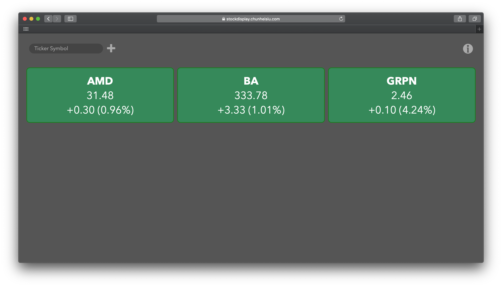

## StockDisplay: Dashboard for Stocks 📈

This repository contains the source files for StockDisplay, a client-side only web application for displaying stock prices.

### Instructions
To add a stock that you wish to display in the dashboard, enter its ticker symbol in the text box and click the "Plus" sign. Alternatively, supplied the list of ticker symbols, comma-seperated, in the URL in the following format, with the symbols 

`https://stockdisplay.chunheisiu.com/?symbols=<symb1>,<symb2>...`

To preserve the list of currently displayed stocks, simply bookmark the page in your browser.
